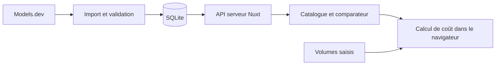

# Model Price Explorer — Plan de projet

Date de rédaction : 23 septembre 2026.

Projet d'équipe de software engineering. Ce document propose le périmètre et l'organisation de la réalisation ; aucune implémentation n'est engagée.

## 1. Objectif et utilisateurs

Créer une application web permettant de rechercher des modèles de langage, de comparer leurs offres API et d'estimer leur coût pour un même scénario d'utilisation.

**Question à laquelle l'application répond :** « Pour mon volume de requêtes et mes contraintes techniques, quelles offres correspondent à mon besoin et combien coûteraient-elles ? »

Public cible : étudiants, développeurs et petites équipes qui doivent choisir une API pour un projet.

La valeur du projet repose sur un parcours complet : filtrer selon ses contraintes, sélectionner quelques offres, puis les comparer avec ses propres volumes de tokens. Le prix seul ne constitue pas une mesure de qualité du modèle.

L'application consulte des métadonnées et effectue des calculs classiques. Elle n'exécute aucun modèle et ne nécessite aucune clé d'inférence des utilisateurs.

## 2. Contraintes connues et décisions proposées

| Sujet | Décision ou état |
| --- | --- |
| Projet choisi | Idée 2 : Model Price Explorer |
| Objectif de complexité | Application utile, accessible à construire en équipe |
| Langage imposé | Aucun |
| Stack proposée | Nuxt, TypeScript, Tailwind CSS, SQLite |
| Source initiale | Models.dev |
| Périmètre de calcul | Requêtes textuelles, facturation standard par token, USD |
| Taille de l'équipe | 3 personnes |
| Échéance et disponibilité | Non communiquées ; planning organisé par jalons |
| Livrables obligatoires du cours | Non communiqués ; liste indicative en section 14 |

La stack est une proposition adaptée aux préférences connues de Noé. Les trois rôles proposés ci-dessous sont à attribuer aux membres de l'équipe ; les dates dépendent de l'échéance et des consignes du cours.

## 3. Périmètre du MVP

### Fonctionnalités indispensables — P0

| Fonctionnalité | Comportement attendu | Critère d'acceptation |
| --- | --- | --- |
| Catalogue | Liste des offres : nom, fournisseur, prix d'entrée/sortie, contexte et capacités | Au moins 20 offres textuelles de 3 fournisseurs dans le jeu de recette, avec provenance visible |
| Recherche et filtres | Recherche par nom ; fournisseur, contexte minimal, tool calling et prix maximal d'entrée | Les filtres se combinent et l'absence de résultat est expliquée |
| Tri et pagination | Tri par prix d'entrée, prix de sortie ou contexte ; 25 résultats par page | Les valeurs inconnues restent en fin de liste et le tri est stable |
| Fiche d'offre | Détails, limites, source, fournisseur et date de collecte | Une offre est identifiable sans ambiguïté, même si plusieurs fournisseurs servent un modèle similaire |
| Comparateur | Sélection de 2 à 4 offres et affichage des mêmes caractéristiques | Ajout, retrait et limite de sélection fonctionnent ; une valeur absente est signalée |
| Calculateur | Estimation pour un volume mensuel et des tokens moyens par requête | Les offres compatibles sont comparées sur les mêmes hypothèses ; les autres indiquent la raison de l'exclusion |
| Synchronisation | Collecte et stockage du catalogue côté serveur | Une panne de la source conserve la dernière version valide, avec sa date |
| Interface responsive | Utilisation sur ordinateur et mobile | Recherche, comparaison et calcul restent utilisables à 360 px de largeur |

Le nombre d'offres est un objectif de recette, pas un chiffre garanti par la source. Le premier jalon doit confirmer la couverture disponible.

### Améliorations après le MVP — P1

- Favoris enregistrés dans le navigateur, sans compte.
- Scénarios de consommation sauvegardés localement.
- URL partageable contenant la sélection et les paramètres du calcul.
- Graphique simple montrant la part entrée/sortie du coût.
- Export CSV du comparatif et de ses hypothèses.

### Extensions ultérieures — P2

- Calcul tenant compte du cache et de certains paliers de contexte.
- Historique des prix collectés et détection de changements.
- Deuxième source de données, avec provenance explicite par offre.

Le MVP exclut les comptes utilisateurs, paiements, appels de génération, benchmarks exécutés par l'équipe, recommandations par IA, conversion de devises et facturation image/audio/vidéo. MCP Explorer et AI Status Monitor restent deux autres idées de projet ; leur intégration n'est pas nécessaire à ce livrable.

## 4. Parcours et écrans

### Parcours principal

1. L'utilisateur ouvre le catalogue et choisit ses contraintes : fournisseur, contexte ou capacité.
2. Il sélectionne jusqu'à quatre offres.
3. Il ouvre le comparateur et vérifie les différences techniques.
4. Il saisit un volume mensuel, une taille moyenne d'entrée et une taille moyenne de sortie facturée.
5. Il consulte le coût estimé de chaque offre compatible et suit le lien du fournisseur pour vérifier ses conditions.

### Écrans

| Route proposée | Contenu |
| --- | --- |
| `/` | Catalogue, recherche, filtres, pagination et sélection persistante pendant la navigation |
| `/offers/[id]` | Fiche de l'offre et bouton d'ajout au comparateur |
| `/compare` | Tableau comparatif et formulaire du scénario de coût |
| `/about` | Méthode de calcul, provenance des données et limites du périmètre |

Sur ordinateur, privilégier un tableau lisible et une barre indiquant les offres sélectionnées. Sur mobile, utiliser des cartes pour le catalogue et un tableau comparatif avec défilement horizontal contenu dans sa zone.

Prévoir les états chargement, catalogue vide, erreur, source périmée et offre retirée. Les prix doivent toujours porter leur unité. Les champs ont un libellé, les actions sont utilisables au clavier et les différences ne reposent pas uniquement sur la couleur.

L'état de sélection doit être partagé entre les pages. Les favoris et scénarios P1 peuvent utiliser un stockage navigateur versionné, lu uniquement côté client pour respecter le rendu serveur.

## 5. Source de données et règles de normalisation

### Source principale

Models.dev publie un catalogue JSON regroupant des fournisseurs et leurs offres : [API du catalogue](https://models.dev/api.json). Son [README](https://github.com/anomalyco/models.dev#api) décrit l'accès aux données et exprime les tarifs d'entrée/sortie en USD par million de tokens.

Le projet maintient aussi un [schéma des données](https://github.com/anomalyco/models.dev/blob/dev/packages/core/src/schema.ts), qui prévoit notamment des prix absents et des paliers tarifaires. Il faudra enregistrer un échantillon daté lors du premier jalon pour vérifier la forme réelle du JSON consommé.

Ce catalogue est communautaire. Une collecte récente ne garantit pas que chaque prix a été vérifié récemment auprès de son fournisseur. Afficher séparément la date de collecte et la date de mise à jour fournie par la source lorsqu'elle existe.

### Unité de comparaison

Une ligne représente **une offre d'un modèle chez un fournisseur**.

- Clé métier : couple `provider_id` + `model_id`.
- Identifiant local stable et utilisable dans une URL : `offer_id`.
- Deux modèles portant un nom proche ne sont jamais fusionnés automatiquement.
- Les abonnements à des applications ne sont pas assimilés à des offres API facturées au token.
- Commencer avec une liste explicite de trois fournisseurs d'API, sélectionnés lors du contrôle initial de la source.

### Données absentes et cas particuliers

- Une donnée absente devient `null` ; l'interface affiche « Non renseigné ».
- Une capacité peut être oui, non ou inconnue. Inconnue ne signifie pas non.
- Un prix nul reste distinct d'un prix absent. Afficher « 0 USD déclaré » sans promettre une utilisation gratuite illimitée.
- Un tarif n'est calculable que si sa base de facturation est compatible avec le scénario standard décrit en section 6.
- Une offre avec paliers, supplément séparé de raisonnement ou conditions tarifaires non interprétées conserve sa fiche, mais son estimation est marquée « Non prise en charge ».
- Une offre disparue d'un import complet valide reste identifiable comme « Absente du dernier catalogue ». Cela ne prouve pas que son API est en panne.
- Une entrée signalée comme obsolète par la source est masquée du catalogue par défaut et reste consultable depuis une ancienne sélection.

### Synchronisation proposée

1. Importer le catalogue au premier lancement, puis vérifier sa fraîcheur au démarrage.
2. Sur le serveur Node permanent, vérifier périodiquement si le dernier import réussi date de plus de 24 heures.
3. Télécharger le JSON depuis l'URL fixe de Models.dev, avec délai maximal et taille de réponse bornés.
4. Valider l'enveloppe, les identifiants et les champs utilisés. Ignorer les nouveaux champs non exploités.
5. Normaliser les offres du périmètre ; vérifier l'unicité des clés et les prix non négatifs.
6. Publier le nouvel état dans une transaction SQLite, après validation complète du périmètre importé.
7. En cas d'erreur, garder la dernière version valide, enregistrer l'échec et réessayer plus tard. Un verrou empêche deux imports simultanés.

Si le dernier succès dépasse 48 heures, afficher « Données potentiellement anciennes ». Une requête utilisateur lit la base locale ; elle ne relance pas le téléchargement du catalogue entier.

Sans aucun catalogue valide, l'application présente une indisponibilité explicite. Un jeu de démonstration daté peut être activé pour une soutenance, avec la mention visible « Données de démonstration ».

## 6. Calculateur : contrat métier

### Saisies

| Paramètre | Sens |
| --- | --- |
| `requests_per_month` | Nombre de requêtes sur un mois |
| `input_tokens_per_request` | Moyenne de tous les tokens envoyés : instructions, historique et message |
| `output_tokens_per_request` | Moyenne des tokens de sortie facturés, pas seulement des mots visibles |

Les nombres saisis sont des entiers positifs ou nuls, avec bornes explicites. Pour le MVP : au maximum 100 millions de requêtes mensuelles et 10 millions de tokens par requête, puis application des limites plus restrictives propres à chaque offre.

### Formule du scénario standard

```text
coût par requête =
  (tokens d'entrée × prix d'entrée par million
   + tokens de sortie × prix de sortie par million) / 1 000 000

coût mensuel = coût par requête × nombre de requêtes mensuelles
```

Exemple pédagogique avec des prix fictifs : 2 USD par million en entrée et 8 USD par million en sortie. Pour 1 000 tokens d'entrée, 500 tokens de sortie et 10 000 requêtes mensuelles : entrée = 20 USD, sortie = 40 USD, total = **60 USD/mois**.

### Règles de fiabilité

- Calculer uniquement les offres avec les deux prix renseignés et une tarification standard prise en charge.
- Utiliser une arithmétique décimale pour les montants ; arrondir uniquement à l'affichage final.
- Vérifier les limites d'entrée, de sortie et de contexte connues par requête. Si une limite connue est dépassée, indiquer l'incompatibilité et l'exclure du classement.
- Si une limite nécessaire est inconnue, préciser « Compatibilité à vérifier » ; ne pas attribuer de badge « Offre compatible la moins chère ».
- Les volumes sont des hypothèses moyennes. Leur conformité ne garantit pas que toutes les requêtes réelles rentreront dans le contexte.
- Les coûts de cache, outils, requêtes fixes, taxes, remises, batch et médias ne sont pas inclus. Une offre exigeant un supplément non modélisé ne reçoit pas de total présenté comme complet.
- Les tokens de raisonnement facturés au même tarif que la sortie doivent être compris dans la saisie de sortie. Une facturation séparée du raisonnement reste hors calcul MVP.
- Les offres à tarif nul sont présentées à part tant que leurs conditions n'ont pas été vérifiées ; elles ne gagnent pas automatiquement le classement.
- Afficher la décomposition entrée/sortie, la devise, les hypothèses et la date des données à côté du résultat.

Le libellé du résultat est « Coût estimé pour ce scénario ». Aucun score global de qualité n'est déduit des prix.

## 7. Architecture et stack proposées

| Couche | Choix | Raison |
| --- | --- | --- |
| Interface et serveur | Nuxt avec TypeScript | Une application et un langage partagés par l'équipe |
| Styles | Tailwind CSS | Interface responsive et composants visuellement cohérents |
| API interne | Routes serveur Nuxt | Contrat stable entre le catalogue externe et l'interface |
| Stockage | SQLite, accès SQL limité à un module | Catalogue persistant sans service de base de données séparé |
| Validation | Zod | Vérifier les données importées et les paramètres de l'API |
| Calcul | Module TypeScript pur avec arithmétique décimale | Calcul testable et réutilisable sans dépendre de l'interface |
| Tests | Vitest et quelques parcours Playwright | Vérifier les règles métier et le parcours utilisateur complet |
| Exécution | Serveur Node unique avec disque persistant | Adapté au stockage SQLite et à la collecte périodique |

La documentation Nuxt consultée via Context7 confirme l'usage de ses routes API avec une récupération compatible SSR via `useFetch`. Références : [serveur Nuxt](https://nuxt.com/docs/4.x/guide/directory-structure/server) et [récupération de données](https://nuxt.com/docs/4.x/getting-started/data-fetching).



Le backend assure la collecte, la normalisation et la consultation. Le calculateur est une fonction métier côté navigateur : il n'envoie ni prompt ni scénario à Models.dev.

### Organisation prévue

```text
app/
  pages/              Catalogue, fiches, comparaison, méthode
  components/         Filtres, tableaux, formulaire, états de chargement
  composables/        Sélection commune et favoris éventuels
server/
  api/                Endpoints de lecture
  services/           Collecte et normalisation Models.dev
  repositories/       Accès SQLite
shared/
  types/              Contrats de données
  domain/             Calculs et validation du scénario
tests/
  fixtures/           Échantillons datés et cas synthétiques
  unit/               Calcul et normalisation
  integration/        API et import transactionnel
  e2e/                Parcours catalogue vers comparaison
```

## 8. Modèle de données minimal

Les noms suivants désignent le schéma interne proposé, pas un contrat imposé par Models.dev.

| Entité | Champs principaux | Contraintes |
| --- | --- | --- |
| `providers` | `id`, `name`, `documentation_url` | Identifiant unique de la source |
| `offers` | `id`, `provider_id`, `model_id`, `name`, prix entrée/sortie, contexte, limites entrée/sortie, modalités, capacités | Unicité de `(provider_id, model_id)` ; prix et capacités peuvent être inconnus |
| `offers` — provenance | `source_url`, `source_updated_at`, `fetched_at`, `present_in_catalog`, `source_status` | Ne pas confondre collecte récente, mise à jour du modèle et disponibilité API |
| `offers` — estimation | `pricing_supported`, `pricing_reason`, données tarifaires utiles à l'affichage | Une raison lisible explique tout calcul non pris en charge |
| `sync_runs` | Début, fin, résultat, nombre d'offres et résumé d'erreur | Permet de connaître le dernier import réussi et le dernier essai |

Stocker les montants sous forme décimale exacte, sérialisée en texte si nécessaire. Les filtres et tris de prix doivent utiliser une comparaison numérique explicite, jamais l'ordre alphabétique des chaînes. Indexer le fournisseur et la clé métier. Une recherche simple suffit pour le volume prévu ; aucun moteur de recherche externe n'est nécessaire.

Les favoris P1 stockent uniquement des identifiants d'offres dans le navigateur. Si une offre disparaît, conserver un message explicite et permettre son retrait.

## 9. Contrat de l'API interne

| Endpoint proposé | Usage | Règles |
| --- | --- | --- |
| `GET /api/providers` | Fournisseurs disponibles dans les filtres | Retourne uniquement ceux du périmètre |
| `GET /api/offers` | Catalogue filtré et paginé | Recherche, filtres, tri autorisé, page et taille de page bornés |
| `GET /api/offers/[id]` | Détail d'une offre | ID local stable ; erreur 404 explicite si inconnu |
| `GET /api/offers?ids=...` | Charger une sélection pour comparer | Maximum quatre identifiants ; identifiants absents signalés |
| `GET /api/catalog-meta` | Fraîcheur et état du catalogue | Dernier succès, péremption et mode démonstration éventuel |

La liste renvoie les éléments, le total, la page et les métadonnées de fraîcheur. Le détail conserve les mêmes unités et la même définition des capacités. Paramètres invalides : 400 ; aucun catalogue exploitable : 503 ; ancien catalogue encore utilisable : réponse normale accompagnée de sa date et de son état de fraîcheur.

Le rafraîchissement est une tâche interne. L'interface publique ne fournit pas d'action permettant de lancer des imports arbitraires.

## 10. Backlog et dépendances

Les estimations sont des ordres de grandeur en jours-personnes, à recalibrer selon le niveau de l'équipe. Elles ne constituent pas une date de livraison.

| Lot | Travail | Dépendances | Livrable vérifiable | Charge indicative |
| --- | --- | --- | --- | --- |
| L0 | Vérifier le JSON réel, trois fournisseurs et les règles de prix | Aucune | Échantillon daté, liste du périmètre et cas non calculables | 0,5–1 j |
| L1 | Cadrer les écrans et figer les contrats de données | L0 | Maquettes simples et critères d'acceptation partagés | 0,5–1 j |
| L2 | Installer le socle Nuxt, styles, types et vérifications locales | L1 | Application minimale compilable | 0,5–1 j |
| L3 | Import, normalisation, SQLite et dernier catalogue valide | L0, L2 | Import fiable, répété sans doublons | 1,5–2,5 j |
| L4 | API de lecture, recherche, filtres et pagination | L1, L3 | Contrats vérifiés avec des fixtures | 1–1,5 j |
| L5 | Catalogue et fiche responsive | L1, L2 ; intégration après L4 | Navigation et sélection d'offres utilisables | 1,5–2 j |
| L6 | Moteur de coût et tests des règles métier | L0, L1, L2 | Calcul indépendant de l'interface et cas limites vérifiés | 1–1,5 j |
| L7 | Comparateur et formulaire de scénario | L4, L5, L6 | Parcours principal complet | 1–2 j |
| L8 | Recette, accessibilité, erreurs et corrections | L3 à L7 | Critères P0 validés | 1–2 j |
| L9 | Déploiement, documentation et préparation de démo | L8 | Version reproductible et soutenance prête | 1–1,5 j |

La charge totale indicative est de 10,5 à 16 jours-personnes, soit environ 13 à 21 jours-personnes avec une marge de 20 à 30 % pour l'intégration et les imprévus. Cette charge est à répartir entre les trois membres selon leur disponibilité ; elle ne se convertit pas directement en durée calendaire à cause des dépendances. Le temps d'apprentissage d'une stack nouvelle s'y ajoute.

Les lots interface, données et calcul peuvent avancer en parallèle après accord sur les contrats, avec les mêmes fixtures. Les tests métier sont développés avec les fonctionnalités ; L8 sert à l'intégration et à la recette.

## 11. Organisation de l'équipe et jalons

### Responsabilités

| Rôle à attribuer | Périmètre principal | Lots dominants |
| --- | --- | --- |
| Membre A — Interface et catalogue | Maquettes, composants communs, catalogue, filtres, fiche et adaptation mobile | L1, L2, L5 |
| Membre B — Données et API | Source, import, base, normalisation, endpoints, fraîcheur et préparation de l'hébergement | L0, L3, L4 |
| Membre C — Comparaison et calcul | État de sélection, page de comparaison, règles tarifaires, formulaire et tests métier | L6, L7 |

Les trois membres valident ensemble le contrat de données et prennent en charge L8 et L9. A vérifie notamment l'interface et l'accessibilité, B l'import et les endpoints, C les calculs et le parcours comparatif ; chacun documente sa partie et fait relire son travail par un autre membre. La soutenance comprend une démonstration de la contribution de chacun.

Pour réduire les conflits, A possède les pages catalogue et fiche, B le dossier serveur, et C la page de comparaison et le module métier. Les types partagés sont modifiés en concertation. Pendant que B prépare les données, A et C avancent sur les mêmes fixtures validées au jalon J0.

### Jalons sans dates imposées

1. **J0 — Données comprises :** source et unités vérifiées, périmètre de prix choisi.
2. **J1 — Première tranche fonctionnelle :** import persistant, API et catalogue minimal reliés.
3. **J2 — Valeur utilisateur :** recherche, fiche et comparaison reliées au calculateur.
4. **J3 — MVP robuste :** panne de source, valeurs inconnues et cas limites correctement gérés.
5. **J4 — Livraison :** déploiement, documentation et répétition de la démonstration.

À chaque jalon : courte démonstration, vérification des critères et révision du backlog. Si le temps manque, retirer les P1 en premier ; conserver la fiabilité des unités, des calculs et de la provenance.

Chaque fonctionnalité est relue par un autre membre avant intégration. Les critères d'acceptation et les tests du lot servent de base à cette revue.

## 12. Stratégie de vérification

| Niveau | Cas essentiels |
| --- | --- |
| Normalisation | Deux fournisseurs avec le même `model_id` restent distincts ; IDs contenant `/` ; prix absent versus zéro ; capacité inconnue ; entrée obsolète |
| Calcul | Exemple fictif à 60 USD ; volume nul ; valeurs négatives refusées ; précision des petits prix ; dépassement de contexte ; tarif à paliers exclu |
| Classement | Même scénario pour toutes les offres ; offre non calculable exclue ; prix inconnu et offre à conditions inconnues ne gagnent pas le tri de coût |
| Import et stockage | Import répété sans doublon ; réponse invalide conservant l'ancien catalogue ; échec sans données initiales ; disparition après import complet ; persistance après redémarrage |
| API | Filtres combinés, ordre stable, limite de pagination, identifiant inconnu et métadonnées de fraîcheur |
| Parcours complet | Recherche → sélection de trois offres → comparaison → saisie du volume → lecture du total ; utilisation sur mobile |

Les tests automatiques utilisent des fixtures figées ; ils ne dépendent pas du réseau ni des tarifs du jour. Un contrôle manuel initial et avant livraison compare quelques offres à la source et aux pages des fournisseurs.

Objectifs de recette supplémentaires : aucun appel d'inférence observé dans le réseau, aucun plantage sur les états vides, typecheck et build réussis, et endpoint catalogue répondant en moins de 500 ms à chaud sur le jeu de recette et l'environnement de démonstration documentés. Ce dernier seuil est une cible à mesurer.

## 13. Risques et solutions prévues

| Risque concret | Réponse prévue |
| --- | --- |
| La source est indisponible ou change de structure | Validation, fixtures et conservation du dernier import valide |
| Les prix sont incomplets ou ont des conditions particulières | État non calculable avec raison, source visible et périmètre textuel standard |
| Un zéro est interprété comme gratuité universelle | Affichage du tarif déclaré et vérification des conditions avant classement |
| Le même nom de modèle apparaît chez plusieurs fournisseurs | Clé composée et fournisseur affiché dans toutes les vues |
| Le projet devient trop large | Les fonctionnalités P1/P2 restent hors engagement MVP |
| SQLite est déployé sur un disque éphémère | Serveur unique avec volume persistant ; vérifier un redémarrage lors de la recette |
| La soutenance dépend d'une connexion instable | Mode démonstration avec échantillon daté explicitement signalé |
| Les membres développent des formats incompatibles | Types partagés, contrat d'API et fixtures communs avant le travail parallèle |

## 14. Déploiement et livrables

Prévoir un seul processus Node et un volume persistant pour SQLite. Choisir l'hébergement avec l'équipe selon le budget disponible ; aucun coût mensuel n'est supposé acquis. Les seuls coûts attendus du MVP sont ceux de l'hébergement éventuel, sans consommation de tokens d'inférence.

Le processus de livraison doit préciser l'installation, le build, le lancement, l'emplacement de la base et la récupération après échec d'import. Le catalogue doit rester disponible après un redémarrage. Le mode démonstration doit être activable séparément du mode normal.

Livrables proposés, à ajuster aux exigences du cours :

- Application fonctionnelle et procédure de lancement reproductible.
- README : objectif, stack, configuration, lancement et tests.
- Description de l'architecture, modèle de données et contrat des endpoints.
- Backlog avec critères d'acceptation, répartition réelle et état des lots.
- Résultats de recette et explication des décisions techniques principales.
- Démonstration montrant un scénario complet et un cas de données indisponibles.
- Attribution de Models.dev et conservation des notices applicables aux éléments réutilisés ; le dépôt source publie une [licence MIT](https://github.com/anomalyco/models.dev/blob/dev/LICENSE).

## 15. Scénario de soutenance

1. Présenter le besoin : choisir une offre API pour un projet au budget limité.
2. Filtrer le catalogue par contexte et capacité, puis sélectionner trois offres.
3. Saisir 10 000 requêtes mensuelles, 1 000 tokens d'entrée et 500 tokens de sortie.
4. Montrer la décomposition du coût, changer le volume et observer la mise à jour.
5. Ouvrir une offre à tarification non prise en charge et expliquer pourquoi aucun total trompeur n'est affiché.
6. Simuler localement une panne de la source et montrer le dernier catalogue valide accompagné de sa date.
7. Expliquer les responsabilités de chaque membre et montrer les tests des règles de calcul.

Les prix de la démonstration proviennent du catalogue chargé. L'exemple fixe à 60 USD sert exclusivement à vérifier la formule avec des données fictives.

## 16. Critères de fin du MVP

- [ ] Les unités et la structure de la source ont été vérifiées sur un échantillon daté.
- [ ] Le catalogue, les filtres, les fiches et la comparaison fonctionnent ensemble.
- [ ] Toutes les estimations respectent le contrat métier de la section 6.
- [ ] Chaque offre affiche son fournisseur, sa provenance et la fraîcheur des données.
- [ ] Les prix absents, les conditions inconnues et les limites non renseignées ont un traitement explicite.
- [ ] Les imports sont persistants, atomiques et résistants à une panne de la source.
- [ ] Le parcours principal est utilisable au clavier et sur mobile.
- [ ] Les tests essentiels, le typecheck et le build réussissent.
- [ ] L'application se lance depuis la procédure documentée et survit à un redémarrage.
- [ ] La démo et les livrables du cours ont été préparés par l'équipe.
