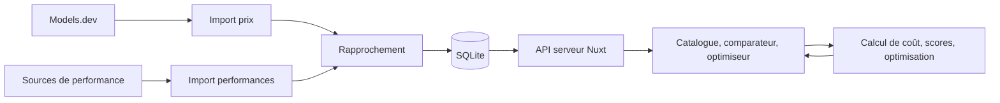

# Model Price Explorer — Spécification fonctionnelle

Date de rédaction : 23 septembre 2026. Mise à jour : 29 septembre 2026.

## 1. Objectif

Application web qui aide à choisir une API de modèle de langage en croisant trois dimensions : **le prix, la performance et la tâche à accomplir**.

Questions auxquelles l'application répond :

- « Pour mes tâches et mon budget, quelles offres me donnent la meilleure qualité ? »
- « Pour mes tâches et un niveau de qualité minimal, quelles offres me coûtent le moins cher ? »
- « Comment ces offres se situent-elles les unes par rapport aux autres en prix, qualité, latence et débit ? »

Public cible : étudiants, développeurs et petites équipes qui choisissent une API pour un projet.

L'application agrège des métadonnées publiques (prix, benchmarks, mesures de latence et de débit) et effectue des calculs. Elle n'exécute aucun modèle et ne demande aucune clé d'API aux utilisateurs. Le prix et la performance sont toujours présentés ensemble : aucun des deux ne suffit seul.

**Stack :** Nuxt, TypeScript, Tailwind CSS, SQLite, Zod, Vitest, Playwright.

## 2. Concepts du domaine

| Concept | Définition |
| --- | --- |
| **Fournisseur** | Entreprise qui expose une API facturée (OpenAI, Anthropic, Groq…) |
| **Modèle** | Un ensemble de poids. Modèles propriétaires : l'alias publié par l'éditeur. Modèles open source : la version exacte |
| **Offre** | Un modèle servi par un fournisseur, avec son prix et ses limites. Unité de base du catalogue |
| **Qualité** | Score d'un modèle sur un benchmark (jeu de questions et notation fixes) ou dans un classement par votes humains (Elo) |
| **Latence** | Temps avant le premier token de réponse, en millisecondes |
| **Débit** | Tokens générés par seconde |
| **Catégorie de tâche** | Famille de travail associée à un ou plusieurs benchmarks (section 9) |
| **Charge de travail** | Besoin mensuel : une ou plusieurs catégories, chacune avec sa part du volume et ses tailles moyennes |
| **Scénario** | Charge de travail + objectif + contraintes, soumis au moteur d'optimisation |

### Rattachement des données

| Donnée | Rattachée à | Raison |
| --- | --- | --- |
| Score de benchmark | **Modèle** | Mêmes poids, mêmes réponses, quel que soit le fournisseur |
| Prix, limites, capacités | **Offre** | Fixés par chaque fournisseur |
| Latence, débit | **Modèle** | Seule mesure disponible dans les sources retenues : médiane par modèle |

La latence et le débit dépendent en réalité de l'infrastructure de chaque fournisseur. L'interface les présente comme « Médiane mesurée par Artificial Analysis, peut varier selon le fournisseur ».

Pour un alias propriétaire, un score mesuré sur une version antérieure reste utilisé, avec la mention « Score d'une version antérieure » et un niveau de confiance réduit.

## 3. Fonctionnalités

### P0 — Cœur de l'application

| Fonctionnalité | Comportement | Critère d'acceptation |
| --- | --- | --- |
| Catalogue | Liste des offres : nom, fournisseur, prix d'entrée/sortie, contexte, capacités, score de la catégorie active, latence, débit | Au moins 20 offres de 3 fournisseurs ; provenance visible pour chaque donnée |
| Recherche et filtres | Nom ; fournisseur, contexte minimal, tool calling, prix maximal, score minimal, latence maximale | Les filtres se combinent ; l'absence de résultat est expliquée |
| Tri et pagination | Tri par prix, contexte, score, latence ou débit ; 25 résultats par page | Valeurs inconnues en fin de liste ; tri stable |
| Fiche d'offre | Prix, limites, capacités, scores par benchmark et par catégorie, latence, débit, sources et dates | Offre identifiable sans ambiguïté ; chaque valeur affiche sa source et sa date |
| Nouveaux modèles | Modèles sortis sur une période récente, triés par date de sortie, avec leurs benchmarks s'ils sont disponibles | Période réglable ; modèle non évalué signalé « Pas encore évalué » |
| Comparateur | 1 à 4 offres comparées par catégorie : tableau des caractéristiques et des scores par catégorie, graphique prix × qualité pour la catégorie choisie | Valeurs absentes signalées ; axes avec unité et catégorie |
| Calculateur de coût | Coût mensuel pour un volume et des tailles moyennes | Contrat de la section 6 |
| Répartition de l'usage | Curseurs en % sur des catégories en langage courant, profils prédéfinis, tailles moyennes par catégorie | Total de 100 % contrôlé ; aucun nom de benchmark exposé dans le formulaire |
| Optimiseur | Mode qualité (budget maximal) ou mode coût (qualité minimale), nombre maximal de modèles à utiliser (1 à 3), contraintes secondaires | Recommandations justifiées ; nombre de modèles respecté ; offres exclues avec leur raison |
| Synchronisation multi-sources | Import, validation et stockage des prix et des performances | Une source en panne garde sa dernière version valide sans bloquer les autres |
| Rapprochement des sources | Relie les identifiants de chaque source aux modèles du catalogue | Aucune fusion silencieuse ; correspondances traçables |
| Interface responsive | Ordinateur et mobile | Tous les parcours utilisables à 360 px |

### P1 — Améliorations

- Saisie libre d'une requête qui pré-remplit la catégorie par mots-clés, toujours modifiable.
- Comptage des tokens à partir d'un texte collé, à la place des tailles moyennes déclarées.
- Mise en évidence des offres non dominées sur le graphique prix × qualité.
- Favoris et scénarios enregistrés dans le navigateur.
- URL partageable contenant la sélection, la charge et les paramètres.
- Export CSV du comparatif et de la recommandation avec ses hypothèses.

### Hors périmètre

Comptes utilisateurs, paiements, appels de génération, benchmarks exécutés par l'application, conversion de devises, facturation image/audio/vidéo, calcul avec cache ou paliers de contexte, historique des prix et des scores, alertes de prix.

## 4. Parcours et écrans

### Parcours optimisation

1. L'utilisateur répartit son usage en pourcentages entre des catégories formulées en langage courant (section 9), à partir de zéro ou d'un profil prédéfini.
2. Il saisit son volume mensuel total de requêtes.
3. Il choisit le nombre maximal de modèles qu'il accepte d'utiliser : 1, 2 ou 3 (offres distinctes, section 8).
4. Il choisit l'objectif : « Meilleure qualité pour un budget de X USD/mois » ou « Coût minimal pour une qualité d'au moins Y », le seuil Y s'appliquant à chaque catégorie de sa répartition.
5. Il ajoute des contraintes : contexte minimal, tool calling, latence maximale, débit minimal, fournisseurs autorisés.
6. Il obtient les meilleures combinaisons classées : les modèles retenus, le modèle à utiliser pour chaque catégorie, le coût total et par catégorie, la qualité obtenue, le niveau de confiance.
7. Il envoie une combinaison au comparateur.

### Parcours exploration

1. L'utilisateur filtre le catalogue depuis l'accueil, ou parcourt les nouveaux modèles.
2. Il sélectionne jusqu'à quatre offres.
3. Il les compare par catégorie, en tableau et sur le graphique prix × qualité.
4. Il saisit un volume et lit le coût estimé de chaque offre.

### Écrans

| Route | Page | Contenu |
| --- | --- | --- |
| `/` | Accueil | Présentation courte et accès direct à l'optimiseur, puis catalogue : sélecteur de catégorie active, recherche, filtres, tri, pagination, barre de sélection |
| `/new` | Nouveaux modèles | Modèles sortis sur les 30, 90 (par défaut) ou 180 derniers jours, du plus récent au plus ancien ; benchmarks et scores par catégorie s'ils existent, sinon « Pas encore évalué » ; offres disponibles avec lien vers leur fiche, la moins chère en premier |
| `/compare` | Comparer | Sélecteur de catégorie, tableau comparatif, graphique prix × qualité sur fond de marché, formulaire de coût (section 10) |
| `/optimize` | Optimiser | Répartition de l'usage en %, nombre maximal de modèles (1 à 3), objectif, contraintes, recommandations, graphique prix × qualité des offres recommandées |
| `/about` | Méthodes | Méthodes de calcul du coût, des scores et de l'optimisation ; sources, attributions et limites |
| `/offers/[id]` | Fiche d'offre | Hors menu, ouverte depuis n'importe quelle liste : prix, limites, scores, sources et bouton d'ajout au comparateur |

Sur ordinateur : tableaux et barre de sélection. Sur mobile : cartes pour le catalogue et les recommandations, tableau comparatif à défilement horizontal contenu.

États gérés : chargement, catalogue vide, erreur, source périmée, offre retirée, score indisponible, aucune combinaison possible. Prix et scores portent toujours leur unité ou leur échelle. Champs libellés, actions accessibles au clavier, différences jamais signalées par la seule couleur.

La sélection et le scénario courant sont partagés entre les pages. Les données P1 stockées dans le navigateur sont versionnées et lues uniquement côté client.

## 5. Sources de données

| Source | Données | Rattachement |
| --- | --- | --- |
| [Models.dev](https://models.dev/api.json) | Prix en USD par million de tokens, contexte, limites, capacités (`tool_call`, `reasoning`, `open_weights`), modalités | Offre |
| [Artificial Analysis](https://artificialanalysis.ai/api-reference) (`/api/v2/data/llms/models`) | Indices intelligence, code et maths ; MMLU-Pro, GPQA, HLE, LiveCodeBench, SciCode, MATH-500, AIME ; latence et débit médians | Modèle |
| [LMArena](https://huggingface.co/datasets/lmarena-ai/leaderboard-dataset) (sous-ensemble `text`, split `latest`) | Scores Elo par catégorie issus de votes humains à l'aveugle (overall, coding, math, et autres catégories présentes dans le jeu) | Modèle |

Contraintes d'accès :

- Artificial Analysis : clé d'API de l'application, stockée côté serveur dans une variable d'environnement ; 1 000 requêtes par jour ; attribution obligatoire vers artificialanalysis.ai, affichée dans le pied de page et sur `/about`.
- LMArena : identifiant `model_name` à rapprocher ; les catégories réellement présentes sont lues à l'import, et seules celles déclarées en section 9 sont exploitées.
- Models.dev : le catalogue contient aussi des modèles d'image et de vidéo ; seuls les modèles dont la sortie contient `text` sont importés. Une limite égale à `0` est traitée comme inconnue.

Chaque source est optionnelle sauf Models.dev : sans prix, l'application affiche une indisponibilité explicite ; sans performances, le catalogue et le calculateur restent utilisables et l'optimiseur est désactivé avec une explication. L'accès programmatique, la licence et l'attribution de chaque source sont vérifiés avant intégration ; une source inaccessible est remplacée par une autre publiant des scores comparables.

**Pas de recouvrement :** Artificial Analysis et LMArena ne publient aucun benchmark commun ; chaque score a donc une seule source, et aucune règle d'arbitrage n'est nécessaire.

### Rapprochement

Les sources nomment les modèles différemment (`gpt-4o-2024-08-06`, `GPT-4o`, `openai/gpt-4o`).

1. Une table de correspondances versionnée dans le dépôt relie `(source, identifiant externe)` à un modèle du catalogue.
2. Une normalisation (casse, séparateurs, préfixe fournisseur, suffixe de date) propose des correspondances candidates lors de chaque import.
3. Une correspondance candidate n'est appliquée qu'après ajout dans la table ; elle figure dans le rapport d'import.
4. Un identifiant non rapproché est conservé et signalé.

### Normalisation

- Clé métier d'une offre : `provider_id` + `model_id`. Identifiant local stable pour les URL : `offer_id`.
- Deux modèles de noms proches ne sont jamais fusionnés automatiquement.
- Donnée absente : `null`, affichée « Non renseigné ».
- Capacité : oui, non ou inconnue. Inconnue ne signifie pas non.
- Prix nul distinct de prix absent : affiché « 0 USD déclaré ».
- Offre avec paliers, supplément de raisonnement séparé ou conditions non interprétées : fiche conservée, estimation « Non prise en charge ».
- Offre disparue d'un import complet valide : « Absente du dernier catalogue ».
- Entrée obsolète selon la source : masquée par défaut, consultable depuis une sélection existante.

### Limites affichées

Source, benchmark et date accompagnent chaque score. La page `/about` explique qu'un score peut être surestimé par contamination (questions vues à l'entraînement) et qu'il mesure un test précis, pas la tâche réelle de l'utilisateur.

## 6. Calculateur de coût

### Saisies

| Paramètre | Sens |
| --- | --- |
| `requests_per_month` | Nombre de requêtes sur un mois |
| `input_tokens_per_request` | Moyenne des tokens envoyés : instructions, historique, message |
| `output_tokens_per_request` | Moyenne des tokens de sortie facturés, raisonnement inclus s'il est facturé au tarif de sortie |

Entiers positifs ou nuls, au plus 100 millions de requêtes mensuelles et 10 millions de tokens par requête, puis limites propres à chaque offre.

### Formule

```text
coût par requête =
  (tokens d'entrée × prix d'entrée par million
   + tokens de sortie × prix de sortie par million) / 1 000 000

coût mensuel = coût par requête × nombre de requêtes mensuelles
```

Exemple fictif : 2 USD/M en entrée, 8 USD/M en sortie, 1 000 tokens d'entrée, 500 de sortie, 10 000 requêtes : entrée 20 USD + sortie 40 USD = **60 USD/mois**.

### Règles

- Calcul uniquement si les deux prix sont renseignés et la tarification standard prise en charge.
- Arithmétique décimale ; arrondi à l'affichage seulement.
- Limite d'entrée, de sortie ou de contexte connue et dépassée : offre exclue avec sa raison.
- Limite inconnue : « Compatibilité à vérifier », jamais de badge « la moins chère ».
- Cache, outils, frais fixes, taxes, remises, batch et médias non inclus.
- Tokens de raisonnement : aucun multiplicateur n'est appliqué. Une info-bulle sur le champ de sortie explique que les modèles marqués `reasoning` génèrent des tokens de réflexion invisibles mais facturés, à inclure dans la saisie ; ces offres portent un badge « Modèle de raisonnement : coût de sortie possiblement sous-estimé ».
- Offres à tarif nul présentées à part tant que leurs conditions ne sont pas vérifiées.
- Résultat affiché avec décomposition entrée/sortie, devise, hypothèses et date des données, sous le libellé « Coût estimé pour ce scénario ».

## 7. Score de qualité par catégorie

1. **Normalisation par benchmark :** chaque score brut est ramené sur [0, 100]. Pourcentages de réussite et indices Artificial Analysis : valeur conservée, multipliée par 100 si la source l'exprime entre 0 et 1. Scores Elo : probabilité de victoire en duel contre le modèle médian du classement, `100 / (1 + 10^((elo_médian − elo) / 400))`. Un modèle moyen vaut environ 50, et 100 points d'Elo d'avance correspondent à environ 64.
2. **Agrégation par catégorie :** moyenne pondérée des benchmarks disponibles de la catégorie (poids de la section 9).
3. **Couverture :** part du poids total effectivement disponible.

| Couverture | Traitement |
| --- | --- |
| ≥ 50 % | Score utilisé ; « Score partiel » affiché si < 100 % |
| < 50 % | Score non fiable : offre traitée comme sans score |

### Niveau de confiance

| Niveau | Condition |
| --- | --- |
| Élevé | Couverture complète, version mesurée identique à la version servie |
| Moyen | Couverture partielle ou score d'une version antérieure |
| Faible | Catégorie sans benchmark spécifique : score général utilisé (section 9) |

## 8. Moteur d'optimisation

Un module TypeScript pur, déterministe, sans dépendance à l'interface ni à la base. Un seul moteur, deux modes.

### Entrées

| Entrée | Contenu |
| --- | --- |
| Charge de travail | Liste de `(catégorie, part du volume, tokens d'entrée, tokens de sortie)` et volume mensuel total |
| Objectif | `maximize_quality` avec budget mensuel maximal, ou `minimize_cost` avec qualité minimale par catégorie |
| Nombre maximal de modèles | `K` entre 1 et 3 : nombre d'offres distinctes (modèle + fournisseur) que la combinaison peut utiliser |
| Contraintes secondaires | Contexte minimal, tool calling, latence maximale, débit minimal, fournisseurs autorisés ou exclus |
| Offres sans score | Exclues des recommandations par défaut ; option « Inclure les offres non évaluées », qui les affiche dans une liste séparée, hors classement |

### Formulation

Pour chaque catégorie `c`, choisir une offre `o` parmi les candidates, en utilisant au plus `K` offres distinctes au total. Coût `cost(c, o)` selon la section 6 avec le volume de `c` ; qualité `q(c, o)` selon la section 7.

- **Mode qualité :** maximiser `Σ part(c) × q(c, o_c)` sous `Σ cost(c, o_c) ≤ budget`.
- **Mode coût :** minimiser `Σ cost(c, o_c)` sous `q(c, o_c) ≥ qualité minimale` pour chaque `c`.

Les deux résolutions ci-dessous s'appliquent à un ensemble d'offres donné ; la contrainte `K` est traitée ensuite en les appliquant à chaque groupe d'offres.

Le mode coût se résout catégorie par catégorie : filtrage, puis offre la moins chère. Le mode qualité est un sac à dos à choix multiples, résolu exactement par fusion de fronts de Pareto :

1. Pour chaque catégorie, filtrer les candidates selon les contraintes et retirer les offres dominées (plus chères et de qualité inférieure ou égale).
2. Partir du front de la première catégorie : ensemble de couples `(coût, qualité pondérée)`.
3. Pour chaque catégorie suivante, combiner chaque point du front courant avec chaque candidate, écarter les combinaisons au-dessus du budget, puis ne garder que les points non dominés.
4. Le front final contient toutes les combinaisons optimales ; les meilleures sous le budget sont retournées.

L'élagage par dominance maintient le front petit pour les tailles visées (jusqu'à 8 catégories, quelques centaines d'offres).

### Contrainte du nombre de modèles

La fusion de fronts ne sait pas compter les offres distinctes. La contrainte `K` est traitée en amont, par énumération des groupes d'offres :

1. **Réduction du vivier :** une offre A domine une offre B si, pour toutes les catégories de la charge, A est au moins aussi bonne et au plus aussi chère. Les offres dominées sont retirées : remplacer B par A ne dégrade jamais une combinaison et n'augmente pas le nombre d'offres. Si le vivier dépasse 20 offres, les 20 meilleures en qualité pondérée sont conservées, et la réponse le signale.
2. **Énumération :** tous les groupes de 1 à `K` offres du vivier sont testés. Avec 20 offres et `K = 3`, cela représente 1 350 groupes au plus.
3. **Résolution par groupe :** dans chaque groupe, chaque catégorie ne peut choisir que parmi les offres du groupe. Mode coût : l'offre la moins chère du groupe qui atteint la qualité minimale. Mode qualité : fusion de fronts de Pareto restreinte au groupe.
4. **Classement :** les meilleures combinaisons de tous les groupes sont fusionnées puis départagées selon les règles ci-dessous.

Avec `K = 1`, chaque offre est évaluée seule sur toute la répartition.

### Départage des égalités

Mode qualité : qualité décroissante, puis coût croissant. Mode coût : coût croissant, puis qualité décroissante. Ensuite, dans les deux modes : confiance décroissante, moins d'offres distinctes, puis `offer_id` croissant.

### Sortie

- Les 5 meilleures combinaisons : offres retenues, offre à utiliser pour chaque catégorie, coût total et par catégorie, qualité par catégorie et pondérée, confiance.
- Pour chaque offre exclue : la contrainte qui l'a écartée.
- Aucune combinaison possible : contrainte la plus bloquante et écart à combler (budget minimal nécessaire ou qualité maximale atteignable).
- Hypothèses et dates des données utilisées.

Une offre non calculable n'est jamais recommandée.

## 9. Catégories de tâches

Les catégories décrivent ce que l'utilisateur fait au quotidien, pas des benchmarks. L'utilisateur ne voit que le libellé et les exemples ; la correspondance avec les benchmarks reste interne et est détaillée sur `/about`.

| Catégorie affichée | Exemples montrés à l'utilisateur | Benchmarks utilisés (interne) | Poids |
| --- | --- | --- | --- |
| Écrire et corriger du code | Générer une fonction, corriger un bug, relire une PR | LiveCodeBench, SciCode, indice code AA, LMArena coding | 0,3 / 0,2 / 0,3 / 0,2 |
| Résoudre des problèmes de maths | Exercices, calculs, démonstrations | AIME, MATH-500, indice maths AA, LMArena math | 0,3 / 0,2 / 0,3 / 0,2 |
| Analyser et raisonner | Questions d'expert, comparer des options, aide à la décision | GPQA, MMLU-Pro, HLE | 0,4 / 0,4 / 0,2 |
| Rédiger des textes | Mails, articles, posts, textes créatifs | Score général* | — |
| Résumer et reformuler | Résumer un document, simplifier un texte, prendre des notes | Score général* | — |
| Extraire des informations | Remplir un tableau depuis un texte, sortir du JSON, classer des messages | Score général* | — |
| Traduire | Traduire un texte, écrire dans une autre langue | Score général* | — |
| Discuter (chatbot, support) | Assistant conversationnel, réponses à des clients | Score général* | — |

\* **Score général** : LMArena overall (0,6) et indice intelligence AA (0,4). Ces catégories n'ont pas de benchmark spécifique dans les sources retenues ; leur score est affiché avec la mention « Score général, pas spécifique à cette tâche » et un niveau de confiance faible. Si une catégorie LMArena correspondante est présente à l'import (par exemple une catégorie d'écriture créative ou multilingue), elle remplace le score général pour cette tâche.

Les poids d'une catégorie sont renormalisés sur les benchmarks présents pour chaque modèle.

### Répartition de l'usage

L'utilisateur décrit son usage en pourcentages, par exemple 30 % de code, 20 % de rédaction, 50 % de discussion :

- Chaque catégorie a un curseur de 0 à 100 % et un champ numérique équivalent ; seules les catégories au-dessus de 0 % entrent dans la charge.
- Le total est affiché en permanence ; l'envoi est bloqué tant qu'il ne vaut pas 100 %, avec un bouton « Ajuster à 100 % » qui redimensionne proportionnellement les parts, que le total soit inférieur ou supérieur.
- Des profils prédéfinis servent de point de départ et restent modifiables après application.
- Des tailles moyennes d'entrée et de sortie sont proposées par catégorie et restent modifiables.

### Profils prédéfinis

| Profil | Répartition |
| --- | --- |
| Assistant de code | Code 70 %, Analyser 15 %, Discuter 15 % |
| Création de contenu | Rédiger 50 %, Résumer 20 %, Traduire 15 %, Discuter 15 % |
| Support client | Discuter 60 %, Extraire 20 %, Résumer 10 %, Traduire 10 % |
| Usage polyvalent | Discuter 30 %, Rédiger 20 %, Code 15 %, Résumer 15 %, Analyser 10 %, Traduire 10 % |

### Tailles moyennes par défaut

Ordres de grandeur indicatifs, affichés comme tels dans le formulaire.

| Catégorie | Tokens d'entrée | Tokens de sortie | Raison |
| --- | --- | --- | --- |
| Code | 2 000 | 800 | Contexte de fichiers envoyé, code généré |
| Maths | 500 | 1 000 | Énoncé court, résolution détaillée |
| Analyser | 1 500 | 800 | Question et documents d'appui |
| Rédiger | 300 | 800 | Consigne courte, texte long |
| Résumer | 4 000 | 400 | Document long, sortie courte |
| Extraire | 2 000 | 300 | Texte source, sortie structurée courte |
| Traduire | 800 | 900 | Sortie proche de l'entrée |
| Discuter | 1 000 | 300 | Historique de conversation, réponses brèves |

## 10. Comparaison prix × performance

### Page `/compare`

Ordre de la page, de haut en bas :

1. **Sélecteur de catégorie** : détermine la catégorie mise en avant dans le tableau et l'axe de qualité du graphique.
2. **Tableau comparatif** : une colonne par offre sélectionnée (1 à 4 ; avec une seule offre, le graphique la situe face au marché). Lignes : prix d'entrée et de sortie, contexte, limites, capacités, score de chaque catégorie avec son niveau de confiance, latence, débit, sources et dates. La meilleure valeur connue de chaque ligne est mise en évidence par un marqueur textuel, pas seulement par la couleur.
3. **Graphique prix × qualité** : composant décrit ci-dessous.
4. **Formulaire de coût** : volume mensuel et tailles moyennes ; coût mensuel de chaque offre selon la section 6.

Sur mobile, le tableau défile horizontalement dans sa zone et le graphique passe sous le tableau.

### Composant graphique prix × qualité

Un seul composant, réutilisé sur `/compare` et sous les résultats de `/optimize`.

- **Axe horizontal :** coût mensuel estimé du scénario courant (sur `/optimize`, coût si l'offre traitait seule toute la répartition) ; à défaut, prix mixte par million de tokens `(3 × prix d'entrée + prix de sortie) / 4`, formule affichée dans la légende.
- **Axe vertical :** score de la catégorie active, sur 0–100.
- **Points mis en évidence :** offres sélectionnées (`/compare`) ou recommandées (`/optimize`), en couleur et étiquetées avec leur nom et leur fournisseur.
- **Contexte :** toutes les autres offres calculables du catalogue, en gris clair, sans étiquette ; leur nom apparaît au survol et au focus clavier.
- **Confiance :** la forme du point indique le niveau de confiance du score.
- **Offres sans score :** listées sous le graphique.
- Le changement de catégorie met à jour l'axe vertical, sa légende et la position des points.

## 11. Synchronisation

Chaque source a son importeur, indépendant des autres.

1. Import au premier lancement, vérification de fraîcheur au démarrage.
2. Vérification périodique : prix toutes les 24 h, performances toutes les 7 jours.
3. Téléchargement depuis une URL fixe, délai maximal et taille de réponse bornés.
4. Validation Zod de l'enveloppe et des champs utilisés ; champs inconnus ignorés.
5. Normalisation puis rapprochement (section 5).
6. Publication dans une transaction SQLite après validation complète de la source.
7. Erreur : dernière version valide conservée, échec enregistré, nouvel essai plus tard. Un verrou par source empêche deux imports simultanés.

Dernier succès plus ancien que deux périodes : « Données potentiellement anciennes » sur les valeurs concernées. Les requêtes utilisateur lisent uniquement la base locale. Un mode démonstration charge des échantillons datés, avec la mention visible « Données de démonstration ».

## 12. Architecture


```mermaid
flowchart LR
    Prices[Models.dev] --> ImportP[Import prix]
    Perf[Sources de performance] --> ImportB[Import performances]
    ImportP --> Match[Rapprochement]
    ImportB --> Match
    Match --> DB[(SQLite)]
    DB --> API[API serveur Nuxt]
    API --> UI[Catalogue, comparateur, optimiseur]
    UI --> Domain[Calcul de coût, scores, optimisation]
    Domain --> UI
```

Le serveur collecte, rapproche, normalise et expose les données. Le calcul de coût, l'agrégation des scores et l'optimisation sont des modules purs dans `shared/domain`, exécutés dans le navigateur : aucun scénario n'est envoyé à une source externe.

```text
app/
  pages/              Accueil et catalogue, nouveaux modèles, fiches, comparaison, optimisation, méthodes
  components/         Filtres, tableaux, graphiques, formulaires, états
  composables/        Sélection, scénario courant
server/
  api/                Endpoints de lecture
  services/
    importers/        Un importeur par source
    matching/         Rapprochement et table de correspondances
  repositories/       Accès SQLite
shared/
  types/              Contrats de données
  domain/
    pricing/          Calcul de coût
    scoring/          Normalisation, agrégation, confiance
    optimizer/        Moteur d'optimisation
    tasks/            Catégories et benchmarks associés
tests/
  fixtures/           Échantillons datés de chaque source
  unit/               Calcul, scores, optimisation, normalisation, rapprochement
  integration/        API et imports transactionnels
  e2e/                Parcours exploration et optimisation
```

## 13. Modèle de données

| Entité | Champs principaux | Contraintes |
| --- | --- | --- |
| `providers` | `id`, `name`, `documentation_url` | Identifiant unique |
| `models` | `id`, `name`, `family`, `version`, `is_open_weights`, `release_date` | Alias pour les propriétaires, version exacte pour l'open source |
| `offers` | `id`, `provider_id`, `model_id`, `input_price`, `output_price`, `context`, `max_input`, `max_output`, `modalities`, `capabilities` | Unicité de `(provider_id, model_id)` ; valeurs inconnues possibles |
| `offers` — provenance | `source_url`, `source_updated_at`, `fetched_at`, `present_in_catalog`, `source_status` | Collecte, mise à jour et disponibilité distinctes |
| `offers` — estimation | `pricing_supported`, `pricing_reason` | Raison lisible pour tout calcul non pris en charge |
| `sources` | `id`, `name`, `url`, `license`, `refresh_period`, `priority` | Une ligne par source |
| `benchmarks` | `id`, `name`, `scale`, `higher_is_better`, `normalization` | Échelle et méthode de normalisation explicites |
| `task_categories` | `id`, `label`, `description` | Liste fixe |
| `task_benchmarks` | `task_category_id`, `benchmark_id`, `weight` | Poids par catégorie |
| `scores` | `benchmark_id`, `model_id`, `raw_value`, `source_id`, `measured_at`, `measured_version` | Unicité de `(benchmark_id, model_id, source_id)` |
| `performance_metrics` | `model_id`, `latency_ms`, `throughput_tps`, `source_id`, `measured_at` | Médianes par modèle |
| `source_mappings` | `source_id`, `external_id`, `model_id`, `status` | `validated`, `candidate` ou `rejected` |
| `sync_runs` | `source_id`, `started_at`, `ended_at`, `result`, `item_count`, `error_summary` | Dernier succès et dernier essai par source |

Les tables `benchmarks`, `task_categories` et `task_benchmarks` sont alimentées au démarrage depuis `shared/domain/tasks`, seule source de vérité des catégories et des poids.

Montants en décimal exact, sérialisés en texte ; filtres et tris numériques explicites. Index sur le fournisseur, la clé métier, `scores(model_id, benchmark_id)` et `source_mappings(source_id, external_id)`.

## 14. API interne

| Endpoint | Usage | Règles |
| --- | --- | --- |
| `GET /api/providers` | Fournisseurs du périmètre | — |
| `GET /api/offers` | Catalogue filtré, trié, paginé | Paramètres validés ; taille de page bornée ; `category` pour les scores |
| `GET /api/offers/[id]` | Détail avec scores, métriques et sources | 404 explicite si inconnu |
| `GET /api/offers?ids=...` | Charger une sélection | 1 à 4 identifiants ; identifiants absents signalés |
| `GET /api/models/new?days=...` | Nouveaux modèles avec leurs scores disponibles | `days` parmi 30, 90, 180 ; tri par date de sortie décroissante |
| `GET /api/task-categories` | Catégories, benchmarks et poids | — |
| `GET /api/candidates?categories=...` | Offres calculables avec prix, limites, scores bruts par catégorie et métriques, pour l'optimiseur et le fond du graphique prix × qualité | Contraintes secondaires appliquées côté serveur |
| `GET /api/catalog-meta` | Fraîcheur et état de chaque source | Dernier succès, péremption, mode démonstration |

Paramètres invalides : 400. Aucun catalogue de prix : 503. Données anciennes : réponse normale avec date et état de fraîcheur. Aucun endpoint public ne déclenche d'import.
